# Transforming Regular Path Queries into SQL
##### University: Institut Polytechnique de Paris 
##### Program: Data and Artificial Intelligence M1
##### Author: Temur Malishava
##### Professor Supervisor: Louis Jachiet
##### 2021

**Introduction**

Regular path queries are one of the most popular ways to work on graphs. Not only do they allow us to produce queries about some path in a graph but they also can be recursive or have a direction. They are also used in many graph query languages like Cypher or SPARQL.

RPQs have the form: _RQP(x, y) := (x, R, y)_ where _R_ is a regular expression over the vocabulary of edge labels. Besides from the elements of the graph it can also include operators. By combining them with the elements of the graph we can have a result of a certain path in it. A simple example of the RPQ would be _a/b_ which means a path in the graph from one node to the other where the first edge has a label ‘_a_’ and the edge after that has a label ‘_b_’.

There are different types of operators in RPQs. For now, we focused on the implementation of the concatenation and the repetition operator ‘_+_’.

**The studied problem**

Databases are a popular way of storing data. There are relational databases, key-value databases, graph databases and many others. It was interesting for us to study the subject of RPQs in the databases and what we wanted to focus on exactly in this research was a way to translate the RPQs into SQL queries.

The idea came from the documentation [1] where the authors proposed a translation of SPARQL property paths into recursive SQL. Our goal was to use these translation techniques and implement them for our task.

Basically, we want to solve the following problem: given a graph _G = (V, E)_ that is stored in an SQL table with three columns and can be represented as a pattern _(u, p, v)_, we want to generate an SQL query that returns all pairs of nodes _(u, v)_ where _u, v ∈ V_ such that there is a path between _u_ and _v_ matching _p_.

After achieving this, we were thinking of expanding on the results and try to see if we could improve upon them. We wanted to test the created SQL code with the help of benchmarking and suggest some other ways of writing it in the certain cases in the hope of improving the running time.

**Contribution**

As a result of our work we have created a program which allows the user to work on the RPQs and translate them into the SQL query. Each operator of the RPQ is represented as a separate class and has a function which translates it into an SQL code.

For the code to be properly tested we also required some graphs with a different number of nodes and a different number of edges. For this, we wrote another program creating an SQL script for random graph creation. The program requires the following parameters: number of nodes in the graph, number of edges in the graph, and the list of edge labels. The created graph is directed and has a structure that includes having more than one edge between two nodes. We can say that we create a directed multigraph.

After that before going right into the optimization part, we wanted to make our job easier with the testing. So instead of creating RPQ objects every time, we made it possible for the program to read the RPQ from the file directly.

Finally, we have created a special operator class which works as an optimizer of the RPQ but can only be used in the certain cases.

**Implementation**

The code is implemented in the following way: we have three classes class RPQ_Predicate, class RPQ_Plus, and class RPQ_Concat. Each of them has a function sql_translation which in the end returns an SQL query selecting the final _u_ and _v_ nodes for the given predicate. But before translating the program recognizes the inner predicates so it knows that first, it has to return the result of the inner RPQs and then from there go back to the original one.

As a result if we consider an example _a/b+_, for this predicate to run in SQL the program first has to create a CTE for nodes with the predicate ‘_a_’ between them, then same for the predicate ‘_b_’, then calculate the CTE for _b+_ and, finally see the concatenation of these two objects.

What if we consider a different approach? We know that a/b+ can be rewritten as _(a/b)/b*_. So instead of calculating the b+ here, we can first calculate the base of a/b and then append the ‘_b_’ predicates one by one. This way we are not calculating _b+_ anymore which is a relatively heavy operation. With this theory in mind we go onto the implementation.

The code is implemented in the following way: we have created a function rpq_reformat which as an input receives an already established RPQ and as an output returns a reformatted version with the idea in mind from the previous paragraph. What it basically does is that it goes all the way down into the RPQ recursively, if there is a concatenation of two objects where at least one of them is an RPQ_Plus, it reformats that RPQ_Concat in the way previously discussed and returns an RPQ_S object in that place.

RPQ_S is a class which in a way represents an RPQ with a star operator in it but not quite. It has 3 parameters _left_, _base_, _right_. The _base_ parameter is always a concatenation of two objects. The _left_ and _right_ are those objects of concatenation depending on whether there is a plus operator or not. So, if we have _a/b+_ we will have _left_ – None, _base_ – _a/b_, _right_ – _b_.

It is also worth mentioning that during the thinking of the optimization strategy one of the ways that came to mind was rewriting the function _a/b+_ as _(a/b)_ OR _(a/b)/b+_. But then we realized that this case would only increase the operation time. This is why you will find an RPQ_Or class in the code which is not neither used nor considered in any other parts of the program.

**Benchmarking**

With the benchmarking we wanted to see how long it would take for different RPQs to be executed for the different graph sizes. For the graph to be easier to interpret we use a plot with a logarithmic scale. This gives a better view of what is happening and allows us to compare the results without any difficulties. It is also worth mentioning that since the graphs are represented as an SQL table of edges, changing the number of nodes does not affect the size of the table which is why for testing we have a constant number of nodes and only vary the number of edges.

For the first plot we are looking into the simplest RPQ. As we can see in the beginning when the number of edges is slowly increasing the optimized version of the RPQ is not faster at all then the non-optimized one. Although after reaching a certain point the execution time drops dramatically to a bit lower level than the execution time of the non-optimized RPQ proving that it is indeed an improved method to work with for a bigger graph but not dramatically.

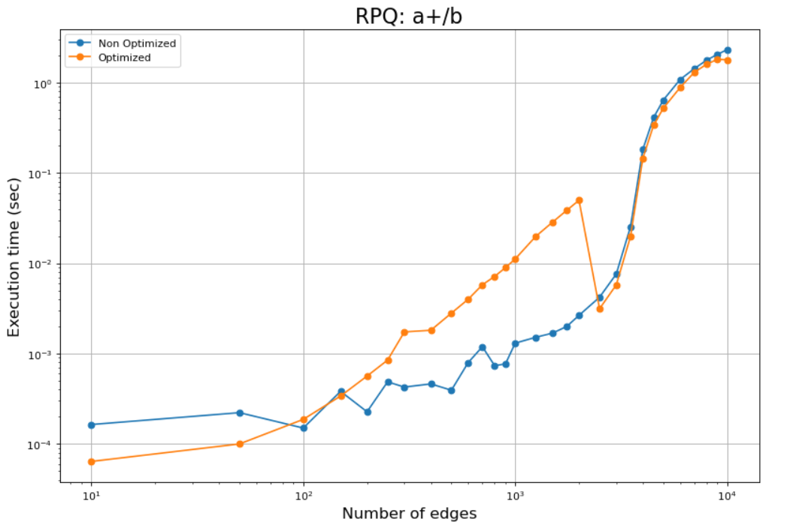

To understand why this change happened we looked into the query plan of the RPQ in that specific moment to see what has changed exactly.

_Before the drop:_

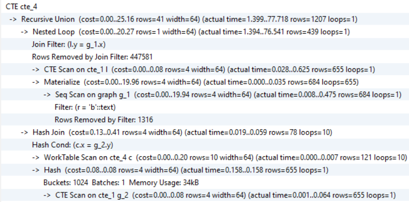

_After the drop:_

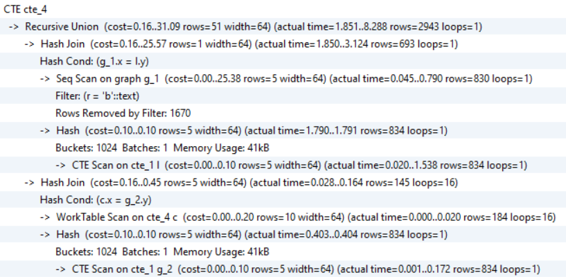

We can see that nested loop was changed by a Hash Join and the Sequential scan was moved up. It is known that for certain types of SQL, the hash join will execute faster than a nested loop join, but the hash join uses more RAM resources which is why it is not used for the simpler cases as they are fast anyways.

Next, we picked a rather medium difficulty RPQ. The optimization is more visible in this case since the RPQ is harder to process. Here as well there is a noticeable drop at some point of reaching a certain x value on the x axis.

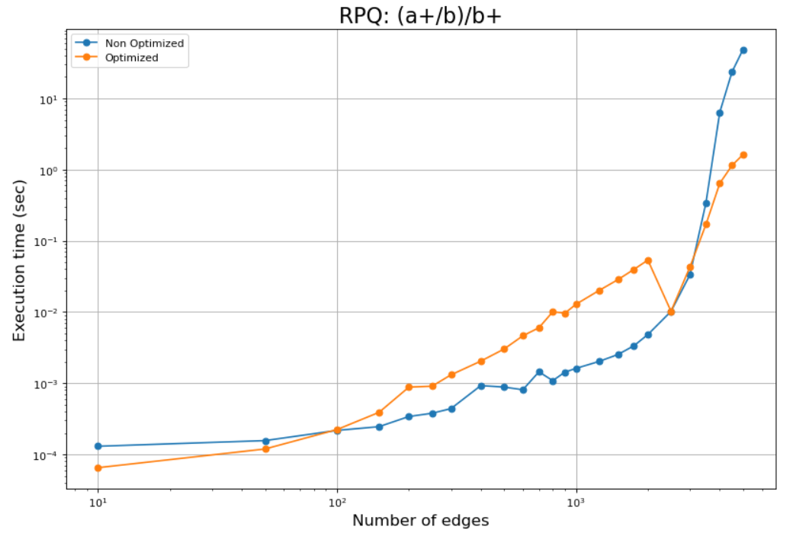

Regarding the query plan, again the nested loop has been changed by the hash join and the sequential scan has been moved up.

_Before drop:_

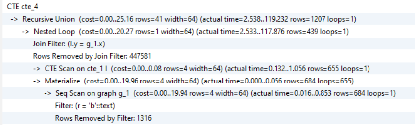

_After drop:_

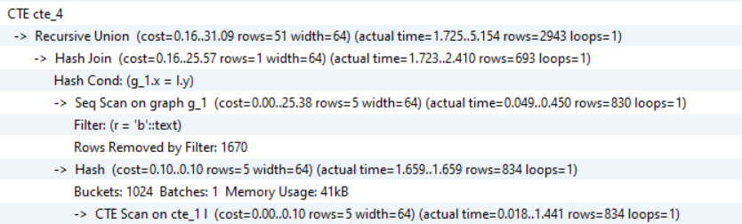

Finally, let’s see how the graph will change with the long and quite difficult to compute RPQ. Here as we can see there are no interesting drops as before although there are some interesting increases.

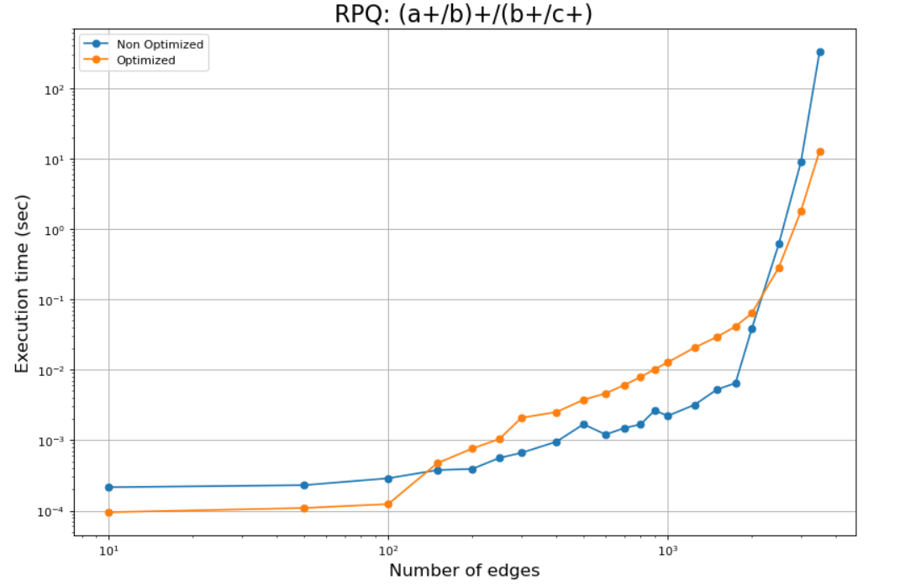

The first increase from the third to the fourth point after looking into the query plan seems to be coming from the removing of some rows during the filtering process. Also, there are notice some buckets being added to most of the CTEs like here which was not there before the increase:

_Before:_

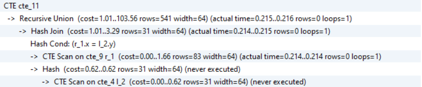
 
_After:_
 
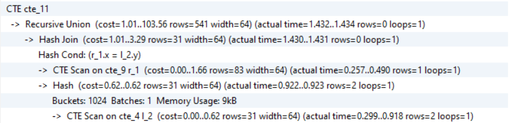

More interesting is the change in the case where the improvement is shown. The change is again the same as in the previous two RPQ cases where the nested loop has been changed to the hash join.

_Before:_
 
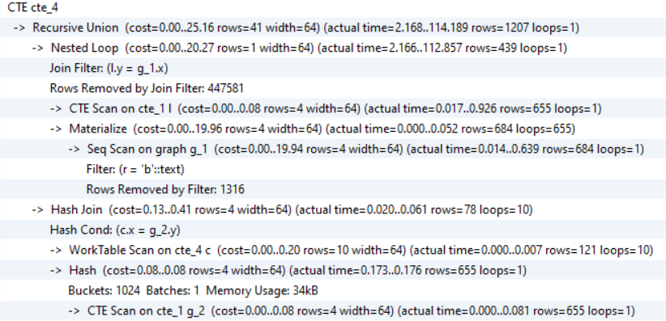

_After:_

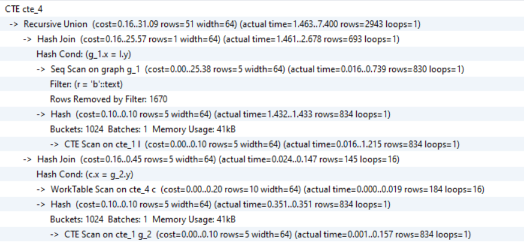
 
**Recap**

To look over what we did let’s have a little recap.

We have managed to create a program which is able to represent the RPQs and translate them into the SQL script format. To test and experiment with our code we have also written a program returning an SQL script for a creation of a random graph table. After that we managed to improve upon our first results and optimize the SQL code in certain cases. We have benchmarked the results and compared the differences between the non-optimized and optimized RPQs and we have shown when the optimization works and when it doesn’t. To make it easier to work with the RPQs we have also created a program which translates the RPQ format from a file into our code’s class-based version of the RPQ.

**Future work**

As we said in the beginning, for the current project we have only focused on the implementation of only some types of the RPQs, concatenation, the repetition operator ‘+’, and maybe ‘or’ operator (which only exists as a separate class and is not considered anywhere else). For future work, we recognize that we could also complete the list with the rest of the possible RPQs.

Other than that, we are also interested in looking into the optimization of the code in the ways that were not considered in this project. There are surely ways to optimize the code which we maybe haven’t thought of or didn’t have time to look into.

**Bibliography**

[1] "Evaluation of SPARQL Property Paths via Recursive SQL, Nikolay Yakovets, Parke Godfrey, and Jarek Gryz Department of Computer Science and Engineering, York University, Canada".

[2] "Overview of Regular Path Queries in Graphs, Andreas Schmidt, Iztok Savnik, The Seventh International Conference on Advances in Databases, Knowledge, and Data Applications, 2015".

[3] "A simple interpreter from scratch in Python, Jay Conrod, 2011".

